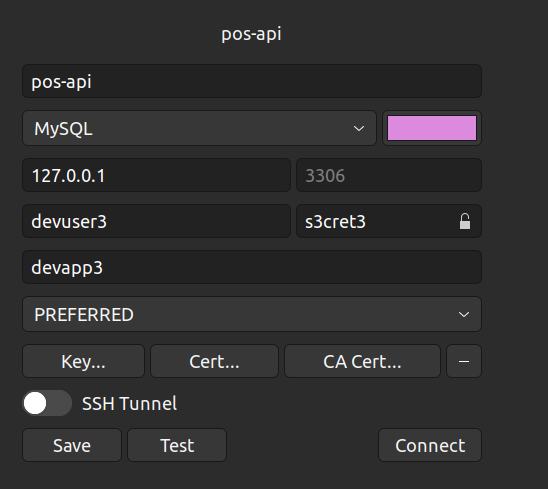

## Start POS by following
We have to go through https://github.com/shahriar1/devserver
Check php version in both devserver/php/Dockerfile and composer.json inside application

# Setup Instructions:

- RUN `git clone https://github.com/shahriar1/devserver.git`
- Copy following dockerfile code and put it inside devserver/Dockerfile
- ```
  FROM php:8.1.8-fpm

    RUN php -r "copy('https://getcomposer.org/installer', 'composer-setup.php');" \
    && php composer-setup.php \
    && php -r "unlink('composer-setup.php');" \
    && chmod +x composer.phar \
    && mv composer.phar /usr/local/bin/composer
    
    
    RUN apt-get update && apt-get install -y \
    git build-essential libmcrypt-dev libreadline-dev zip unzip \
    libssl-dev zlib1g-dev libpng-dev libjpeg-dev libfreetype6-dev \
    jpegoptim optipng pngquant gifsicle webp libzip-dev zlib1g-dev zip unzip libxml2-dev libicu-dev
    
    RUN docker-php-ext-configure gd --with-freetype=/usr/include/ --with-jpeg=/usr/include/
    
    RUN docker-php-ext-install pdo_mysql pcntl bcmath gd soap
    
    RUN docker-php-ext-configure zip \
    && docker-php-ext-install zip
    
    RUN apt-get update && apt-get install -y \
    redis-server \
    && pecl install redis \
    && docker-php-ext-enable redis
    
    RUN pecl install mongodb
    RUN docker-php-ext-enable mongodb
    
    RUN docker-php-ext-configure intl \
    && docker-php-ext-install intl
    
    #WORKDIR /var/www/app
    
    CMD ["/usr/local/sbin/php-fpm"]
  ```
- Check php version in both devserver/php/Dockerfile and composer.json and run `docker-compose up -d`
- Go back and CD into `apps` directory
- Now run `git clone https://github.com/shahriar1/pos-api.git`.
- Edit `/etc/hosts` and use your repo name to point as `127.0.0.1 pos-api`. e.g. Now visit `http://pos-api`
- Now run `docker-compose exec php bash`
- `composer install`
- `php artisan list`
- `php artisan migrate`
- `php artisan key:generate`
### On Ubuntu we may need to run 

- sudo chmod -R 777 apps/pos-api/vendor/

- sudo chmod -R 777 apps/pos-api/storage/logs/laravel.log

- sudo chmod -R 777 apps/pos-api/storage/framework/sessions

### Update your .env exactly as devserver/docker-compose.yml

```RUN 
DB_CONNECTION=mysql
DB_HOST=db
DB_PORT=3306
DB_DATABASE=devapp3
DB_USERNAME=devuser3
DB_PASSWORD=s3cret3
```
For TablePlus it will look like as following:

